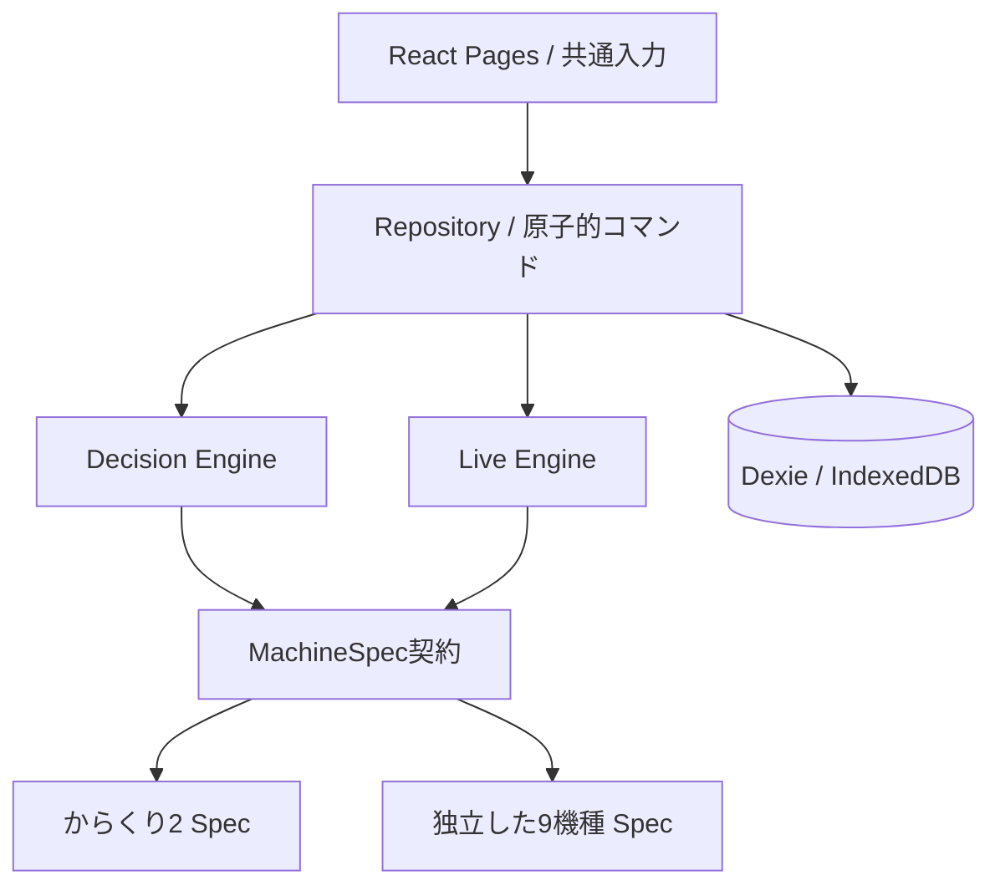

# HALL SCAN architecture

## 責務

依存は `UI → Repository → 共通Engine → MachineSpec`。RepositoryはIndexedDBへ保存します。EngineとMachineSpecはReact、Dexie、DOMに依存しない純粋関数です。Specは共通契約だけをimportし、registryで注入されます。汎用のG数カウンタや機種IDによる巨大switchはありません。

## データ契約

MachineStateはschemaVersion、meta、raw、evidence、resolvedState、derived、session、decision、live、snapshotsを保持。`raw`はspecによるZod検証で機種固有型に変換します。未知の値はnullやunknown。証拠はvalue・acquisition・verification・source・observedAtを持ち、推測をconfirmedへ昇格させません。

今回の4カウンタ：lcdGame、goddessIntervalActualGame、atIntervalActualGame、goddessSkipCount。液晶Gから実Gを生成しません。残りGは対応する実Gが既知の場合のみderivedへ生成。女神以外の失敗で女神スルーや女神間を変更しません。

## 判定とattempt

`evaluate()` はルート配列、重要な不明、候補可能性を返します。共通Engineは投資上限/過大リスク→C確認不能→重要不明→単独適格ルート→B/Dの順。C確認の使用フラグはMachineState.sessionに保存。画面を戻る・reloadするだけではリセットされません。新しい台の記録は別attemptですが、同一試行を続ける間は再度Cにしません。

`EVRoute` はid、eligible、evYen、basis、goal、resetOnly、missingSourceを持ちます。ソートで最大の適格値を1個採用。各表の値は重なる当選結果を含むため、合計というAPIを提供しません。未知の非等価スルーEVはnull。

A生成時にはEntrySnapshotを作成し、raw・context・evidence・decisionをコピーしてdeepFreeze。台の保存後更新やLIVEイベントはそのコピーを変更しません。DecisionSnapshotは判定のたびに追記されます。LIVE開始時は最新の保存状態を再評価し、A・最新版・同一revisionの着席根拠を再確認します。

## LIVE

開始・投資・イベント・終了はRepositoryコマンド。開始は1日1本まで。既投資額は個別ルートのEVに入れません。ただし残り予算と30,000円上限は当日全店舗の合計で検証します。

ルートが消費されるまではEntrySnapshotを維持。女神1回狙いは女神失敗で元根拠を消費。女神3スルー狙いは資料の前提通り失敗後もスルー天井まで続行。AT当選→終了後の幕間/運命の一劇→次状態確認まで一連の流れを明示。次状態確認・一劇失敗で最新状態から再判定。単なるloss_noteやカウンタ進行は撤回理由にしません。

## 永続化とmigration

v1は8テーブル、v2で保存versionメタデータの補完migration。businessDateはAsia/Tokyoの日付。active LIVEが日付をまたいだ場合は前日のセッションを優先復元し、同じLIVEを新しい予算で継続させません。終了済み当日への起動は終了済み状態をそのまま返します。

各コマンドは必要テーブルを含むreadwrite transactionで完了してからUIへ結果を返します。daily投資・live投資・eventを一緒に更新し、途中失敗時は全体をロールバック。UIはDexie liveQueryで変更を購読し、タブ間の反映にも対応。localStorageは判定や資金の保存に使いません。

rules/specが変わった既存Aは開始拒否し、再判定で現在版へ更新。LIVE中に版が変わった場合は古いルールを無条件適用せず、実戦を終了して確認する経路を残します。新migrationは版番号を増やし、投資額・active LIVE参照・snapshot内容が保存されるfixtureを必須にします。

## 残り9機種を安全に追加

1. 最新かつ機種固有の出典と、計算条件・基準日を整理する。未解析値はnull＋TODO_NEEDS_SOURCE。
2. `machine-specs/<slug>/raw-schema.ts` でその機種のカウンタを定義。単位をfield名に含め、別カウンタを共用しない。
3. resolverで取得方法・確信度を保持。derived-rulesで確定情報からだけ残り距離を計算。
4. patrol-rulesはskip/watch/candidate/needs_judgmentだけ返す。greenのA色を使わない。
5. ev-routesで独立した条件付きルートを作る。resetOnlyを宣言し、未確定リセットに専用EVを返さない。
6. decision-rulesで機種固有の重要な不明項目を列挙。LIVEイベントでカウンタや根拠の消費を定義。
7. guideで入力field・イベント・天井・警告・見る場所を宣言し、specをregistryに登録。
8. spec単体テストとRepositoryを通したvertical sliceを追加。共通ハードルール60件相当は全機種追加後も維持。

継続版で追加済みのIDは `kabaneri_kaimon / tokyo_ghoul / monkey_turn_v / lycoris_recoil / sengoku_otome_5 / valvrave_2 / magia_record / hokuto_tensei_2 / enen_2`。設定狙いの試行数はself_observed専用の分母を独立に設計し、前任者データを合成しない。今回その統計機能は実装していません。

UIがspecの宣言を表示するため、機種固有入力やイベントは共通コンポーネントで追加されます。複雑な将来UIが必要な場合も描画adapterだけを追加し、判定ロジックを移動しません。

## 継続版の保存機能

DailyResearchOverrideは任意のresearchOverridesとしてDailySessionに保存し、旧schema v2の日も読み込めます。追加インデックスを必要としない後方互換フィールドです。確認情報は営業日限定で、Engineの基本ルールを書き換えません。

backup.tsは8テーブルと当日確認をtransactionで読み書きし、参照・投資合計・保存版・snapshotの根拠を検証します。既存IDの異なる記録を上書きせず、LIVE中の復元を拒否します。
